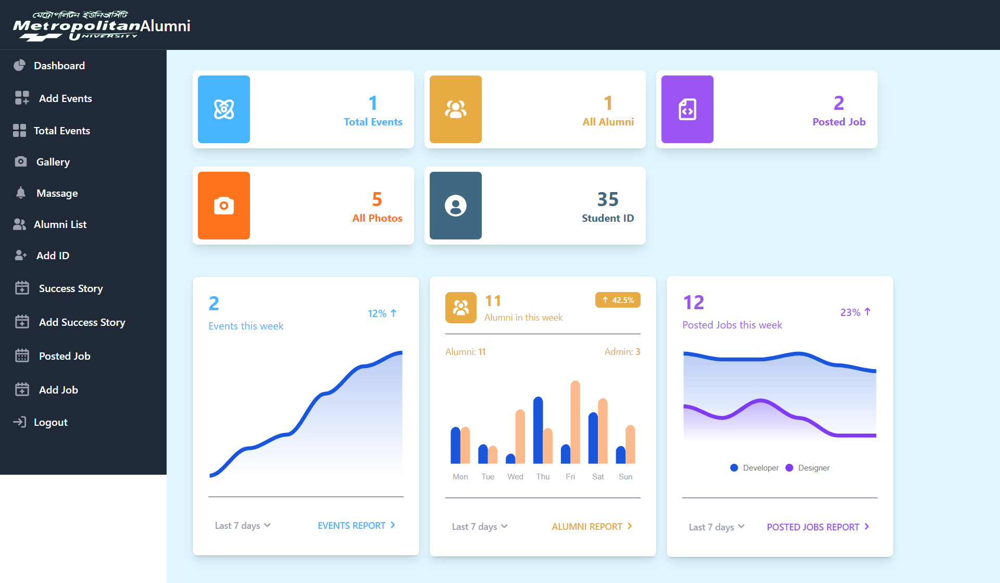

<h1>Alumni-Management-System.</h1>

Alumni Management System using PHP & MySql

<h2>Requirements.</h2>
<ul>
  <li>XAMPP Server</li>
  <li>Browser (Chrome,Mozilla)</li>
  <li>Code Editor (Vim, Sublime Text, VSCode)</li>
</ul>

<h2>Features ADMIN</h2>
<ul>
  <li>ADMIN Login.</li>
  <li>Add/Delete Events.</li>
  <li>Search Alumni.</li>
  <li>Add/Delete/Update Gallery Photos</li>
  <li>Delete Alumni</li>
  <li>Add/Delete/Update Success Story Of university's Students</li>
  <li>Add/Delete/Update Job Post</li>
  <li>Add/Delete Student ID</li>
  <li>Logout</li>
</ul>

  

<h2>Features ALUMNI</h2>
<ul>
  <li>Alumni Registration & Login. </li>
  <li>Update Profile. </li>
  <li>Add/Delete/Update Gallery Photos</li>
  <li>Add Jobs Post</li>
  <li>Logout </li>
</ul>

  

<h1>Features USERS.</h1>
<ul>
  <li>Check Events.</li>
  <li>Search For Alumni.</li>
  <li>Check Jobs Post</li>
  <li>Search For Jobs</li>
  <li>See University's Success Story</li>
  <li>See Gallery Photos</li>
</ul>

  

<h1>How to Setup</h1>
<ul>
  <li>Install XAMPP Server</li>
  <li>Start Apache and MySQL</li>
  <li>Copy the this folder "Alumni Management System to C:\xampp\htdocs</li>
  <li>Open browser and type http://localhost/phpmyadmin/</li>
  <li>Create a new Databse with name "ams"</li>
  <li>Import the sql file from the database folder in Alumni Management System.</li>
  <li>
To open the file in browser type http://localhost/AMS/index.php</li>
</ul>

<h1>Thanks</h1>
